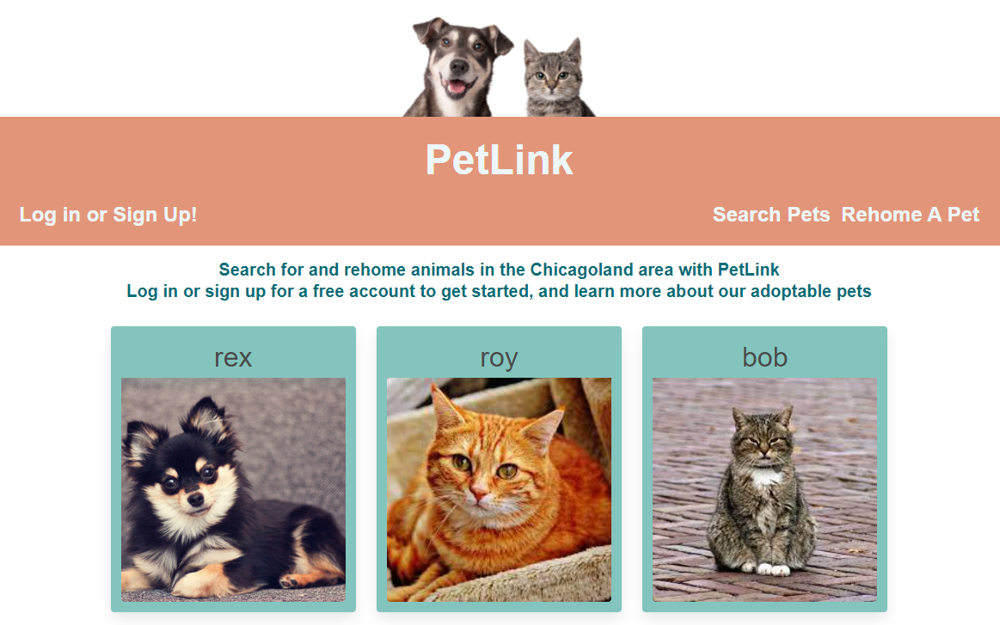
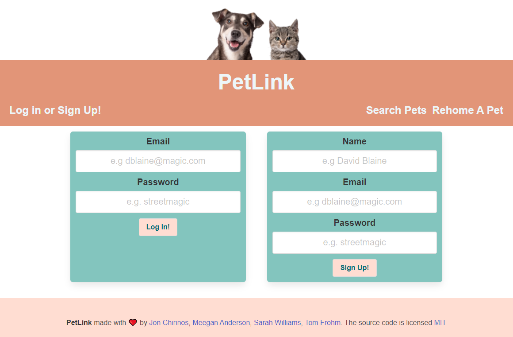
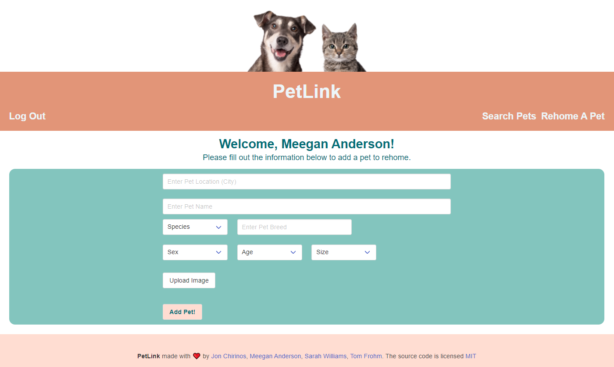
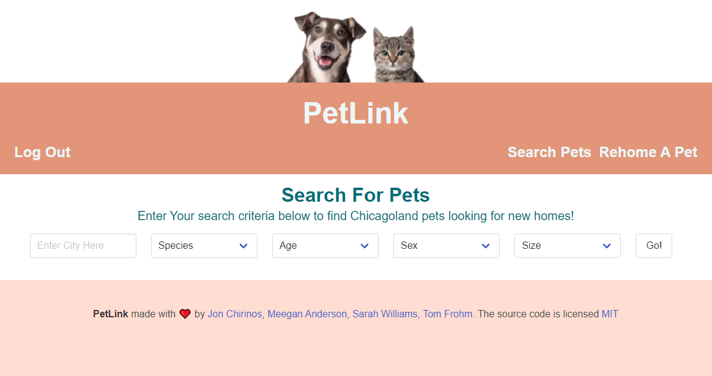
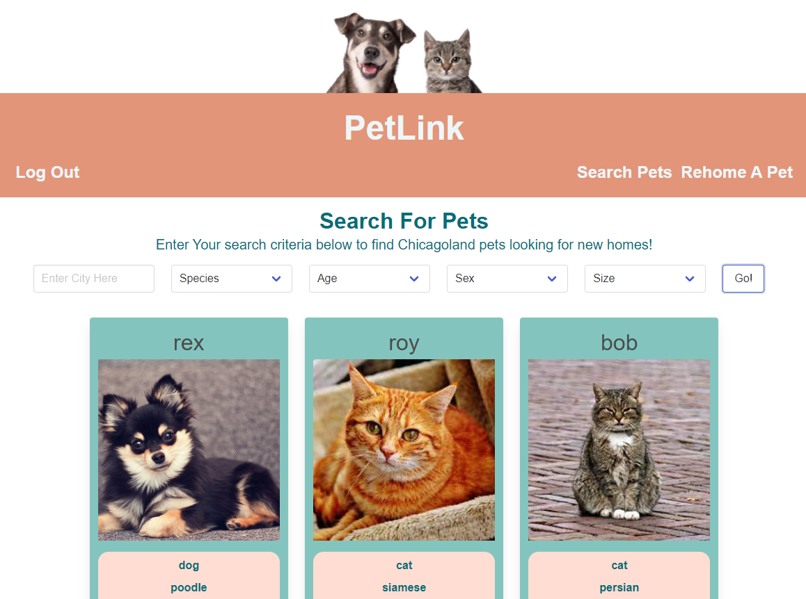

# PetLink


## Description

- Purpose of this project: An owner-to-owner pet adoption application.
- Problem(s) the app solves: Not having an owner-to-owner adoption site for rehoming pets.
- Languages used: HTML, CSS, JavaScript, SQL
- Brief description: To provide an owner-to-owner pet adoption application where users can search for adoptable pets in their area and also add pets to rehome.

## Table of Contents

- [Installation](#installation)
- [Usage](#usage)
- [License](#license)
- [Contributing](#contributing)
- [Tests](#tests)
- [Developers](#developers)
- [Links](#links)

## Installation

This app requires the installation of bcrypt, connect-session-sequelize, dotenv, express, express-handlebars, express-session, graphql-yoga, mysql2, and sequelize. All are included in the package.json file and can be installed with the following input:

```bash
npm install
```

## Usage

 - Homepage:
When the user opens the application, they are presented with the homepage. At the top of the page is a picture of a dog and cat, beneath which is a hero banner with the PetLink name in the center, which is a clickable link back to the homepage. The hero also includes links to the Log In page, the Search Pets page, and the Rehome A Pet page. Beneath the hero are cards showing the names and images of the pets currently in the database. If the user is not logged in and clicks on the "Rehome A Pet" link, they are redirected to the Log In page.
- Log In:
When the user clicks on the Log In link or is redirected from the Rehome A Pet link, they  are presented with the same top image and hero banner as the Homepage. Beneath the hero is a card where the user can enter their email and password to log in if they already have an account. Once that information is entered, the user clicks the "Log In!" button to move on. If they do not have an account, there is another card where the user can sign up by entering their name, email, and password, and clicking the 'Sign Up!' button. Clicking either button will log the user in and direct them to the Search Pets page.
- Search Pets
When the user clicks on the Search Pets on the Homepage or are directed here from the Log In page, they are presented with the same top image and hero banner as the Homepage. The user can search for adoptable pets by entering a city into the city input and selecting species, age, sex, and size from the dropdowns, and then clicking the "Search Pets" button. If the user wants to see all available pets, they can click on the "Search Pets" button with the input blank and none of the dropdowns selected. When the user clicks on the "Search Pets" button, the pets database is searched using the criteria selected, and then cards are generated for each pet. The cards include the pet's name, image, sex, age, size, city, and contact email of the current owner. If the user sees a pet they are interested in, they can contact the current owner via the email listed on the pet's card.  
- Rehome A Pet
When the user clicks on the Rehome A Pet link on the Homepage, they are presented with the same top image and hero banner as the Homepage. There is a welcome message below the hero, and a prompt to fill out the pet's information. The user can enter the Pet's name, species, breed, sex, age, size, and city. There is a button to upload an image of the pet. Once all the inputs are filled in, the dropdowns selected, and a pet image has been added, the user can click "Add Pet" to add that pet to their profile.  When a pet has been added, a new section titled "My Pets To Rehome:", and the name of the pet will appear with a "Delete" button next to it. The user can click on the "Delete" button to remove the pet from their list of pets.   

### Screenshots








## License
    
This application is licensed under the MIT license.

## Contributing

If you would like to contribute to this application, please follow the Contributor Covenant guidelines.

## Tests

You can test this application by typing in unexpected text into inputs.

## Developers

GET-POST-malone
- Go to our organization's github: [GET-POST-malone](https://github.com/GET-POST-malone)

Meegan Anderson
- [NotANewt Github](https://github.com/NotANewt)
- [meegan.r.anderson@gmail.com](mailto:meegan.r.anderson@gmail.com)
- [Meegan's Portfolio](https://notanewt.github.io/portfolio/)

John Chirinos
- [Jonchirinos Github](https://github.com/Jonchirinos)
- [chirinosjon@gmail.com](mailto:chirinosjon@gmail.com)
- [Jon's Portfolio](https://jonchirinos.github.io/portfolio/)

Thomas Frohm
- [tfrohm11 Github](https://github.com/tfrohm11)
- [Tfrohm11@gmail.com](mailto:Tfrohm11@gmail.com)
- [Thomas's Portfolio](https://tfrohm11.github.io/portfolio/)

Sarah Ann Williams
- [Sarahlophus Github](https://github.com/Sarahlophus)
- [sarahann.dev@gmail.com](mailto:sarahann.dev@gmail.com)
- [Sarah's Portfolio](https://sarahlophus.github.io/sawilliams.portfolio/)

## Links

- Here is the repo: [GET-POST-malone/PetLink](https://www.github.com/GET-POST-malone/project_2)
- Here is the heroku pages: [GET-POST-malone/pages](https://get-post-malone-project-2.herokuapp.com/)
